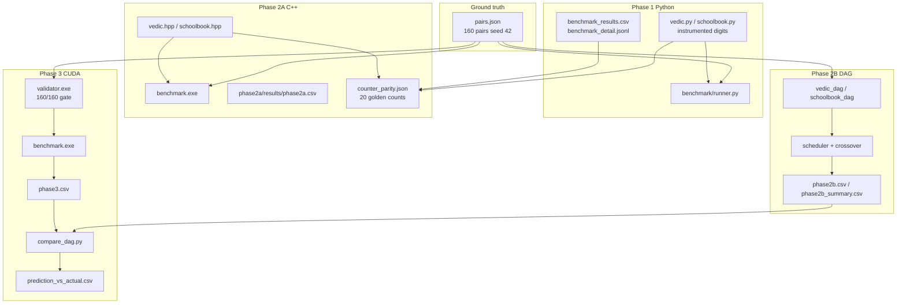
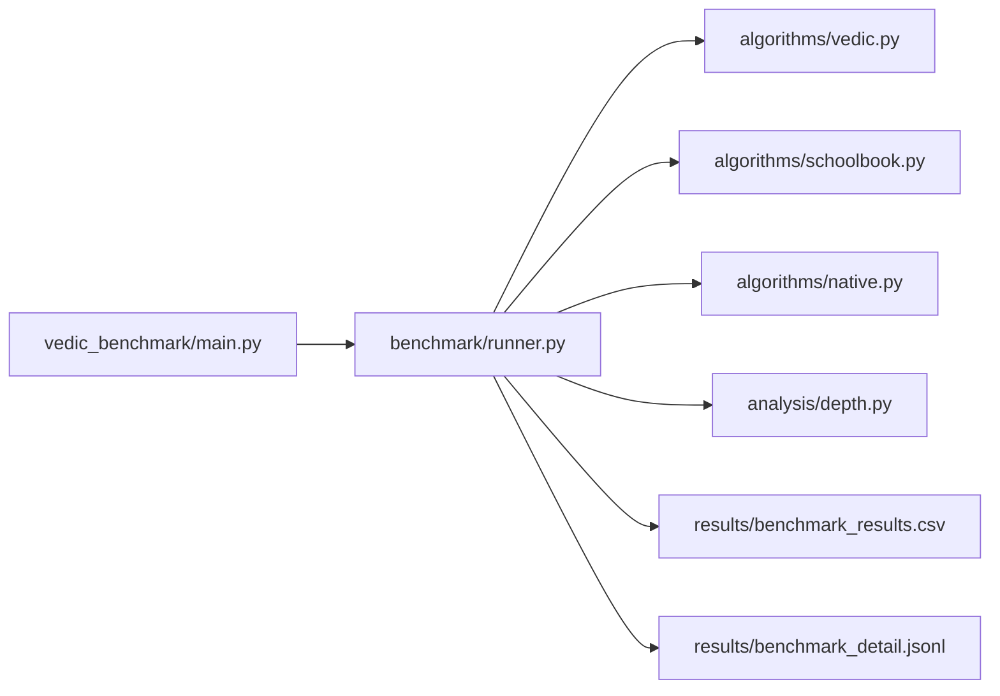
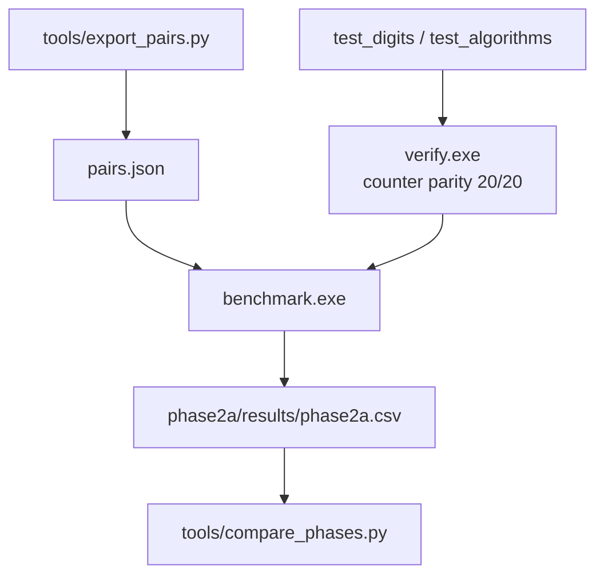
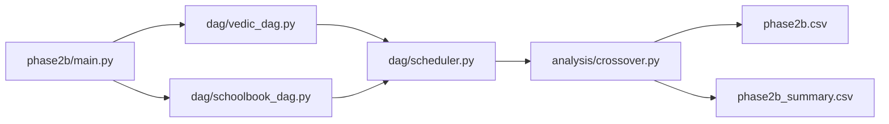
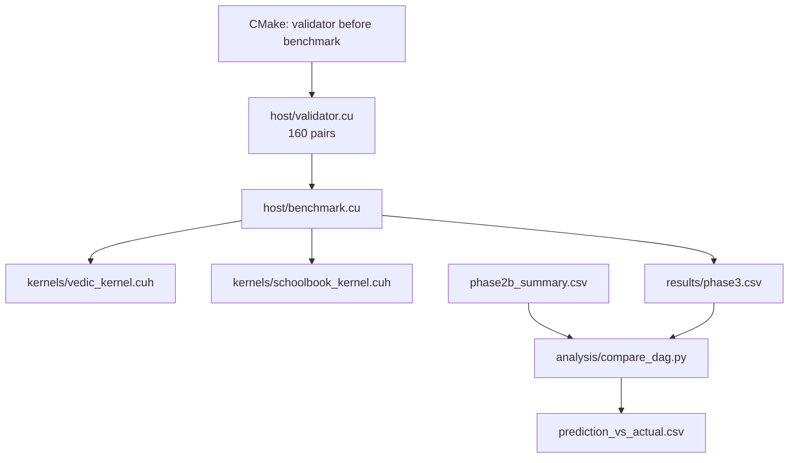

# Vedic Math ML — Multiplication Benchmark & Parallelism Study

Research project comparing **Urdhva-Tiryagbhyam** (Vedic column-wise multiplication) with **grade-school** partial-product multiplication across four phases: instrumented Python benchmarks, a C++ port, a DAG-based scheduler simulator, and CUDA kernels on real GPU hardware.

The central question is not “which method is fastest in Python,” but whether Vedic’s **dependency structure** exposes more useful parallelism for hardware—and whether that structure **predicts** measured GPU speedups.

---

## 1. Goal of the experiment

| Research question | How we answer it |
|-------------------|----------------|
| Are both algorithms **mathematically correct** on random operands? | Every phase asserts `vedic(a,b) == schoolbook(a,b) == a*b` |
| How much **structural work** does each method do? | Count single-digit MULT, ADD, and CARRY events (Phase 1 / 2A) |
| How **parallel** is each method in theory? | DAG width, depth, and `parallelism_score` (Phase 1) |
| How does parallel **completion time** scale with workers for **real** carries? | DAG simulator on actual operand pairs (Phase 2B) |
| Does the DAG model **predict** GPU behavior? | CUDA timing vs Phase 2B predictions (Phase 3) |

**Hypothesis:** Vedic groups work by **output column** (all cross-products with `i + j = k`, then carry). Schoolbook builds **partial-product rows** then accumulates. That structural difference shows up as different parallelism profiles — and above n=4, Phase 2B confirms that Vedic completes fewer sequential dependent steps per multiply, with the critical-path advantage growing to 2× at n=9.

**Out of scope:** Beating `numpy`, production big-integer libraries, or optimal CUDA implementations. Phases 1–3 are **measurement and validation** pipelines.

---

## 2. Requirements

### All phases

| Requirement | Notes |
|-------------|--------|
| **Python 3.10+** | Phase 1, 2B, tools, tests |
| **Git** | Clone this repository |
| **`pairs.json`** | 160 fixed operand pairs (widths 2–9, seed 42); generated once via `phase2a/tools/export_pairs.py` |

```powershell
pip install -r requirements-dev.txt   # pytest for tests
```

### Phase 1 — Python benchmark

- Standard library only for the benchmark core  
- Optional: `matplotlib` for `--chart`

### Phase 2A — C++ port

| Tool | Windows (documented setup) |
|------|----------------------------|
| CMake 3.14+ | `winget install Kitware.CMake` |
| **g++** (MinGW / WinLibs) | `winget install BrechtSanders.WinLibs.POSIX.UCRT` |
| PATH | `CMake\bin`, WinLibs `mingw64\bin` |

### Phase 2B — DAG simulator

- Python 3.10+ and `pytest`  
- No GPU required

### Phase 3 — CUDA

| Tool | Notes |
|------|--------|
| **NVIDIA GPU** + driver | Target: RTX 3050 Ti (SM **8.6**) |
| **CUDA Toolkit** (`nvcc`) | Test: `nvcc --version` |
| **CMake 3.18+** | With CUDA language support |
| **MSVC** (Visual Studio 2022 v17 or later; VS 2026 / v18 also works if installed) | Required as CUDA host compiler on Windows |

PyTorch seeing CUDA does **not** replace `nvcc` + a C++ build for Phase 3.

---

## 3. Shared conventions

### Operand representation

- Base **10**, digits stored **LSB at index 0** (index 0 = ones place)  
- Operands padded to length `n = max(len(a), len(b))` before multiply  
- Lookup table `MULT_TABLE[d1][d2]` for single-digit products (same values in Python, C++, and CUDA)

### Ground-truth pairs

[`pairs.json`](pairs.json) at the repo root: **20 pairs × digit widths 2–9** (160 total), RNG seed **42**. All phases that benchmark use this file so results are comparable.

### Algorithms (conceptual)

**Vedic (Urdhva-Tiryagbhyam)** — for each column `k = 0 … 2n−2`:

- Cross-products: `a[i] * b[j]` where `i + j = k` and `0 ≤ i,j < n`  
- Sum products + fold **carry digit list** from column `k−1` (list semantics, not a single scalar)  
- Result digit at `k` = LSB of column sum; overflow digits become carries into column `k+1`

**Schoolbook** — for each digit `b[j]`:

- Row: `a[i] * b[j]` with row carry chain → partial row digits  
- Accumulate each partial into the result at offset `j` (instrumented digit adds)

---

## 4. Project flow (all phases)



---

## 5. Phase 1 — Python benchmark

### What it measures

1. **Wall-clock time** (`timeit`, microseconds)  
2. **Operation counts** — `multiplications`, `additions`, `carry_propagations`, `total_ops`  
3. **Theoretical DAG metrics** from digit width `N` (not per-pair): `parallel_width`, `sequential_depth`, `parallelism_score`

### Key calculations

**Per pair (instrumented run):**

- Each `single_digit_mult` → `multiplications += 1`  
- Each digit add / carry in `_digits.py` → `additions` / `carry_propagations`  
- Vedic: `multiplications = n²` (padded width)

**Theoretical depth** ([`vedic_benchmark/analysis/depth.py`](vedic_benchmark/analysis/depth.py)) — worst-case column model:

| Algorithm | `parallel_width` | `sequential_depth` |
|-----------|------------------|---------------------|
| Vedic | `N` | `Σ_k (1 + ⌈log₂ p⌉ if p>1 + carry_layer)` where `p = min(k+1, 2n−1−k)` and carry_layer adds 1 if `p×81 ≥ 10` |
| Schoolbook | `N²` | `2N − 1` (row depth `N` + `N−1` accumulations) |

`parallelism_score = parallel_width / sequential_depth`

### Code flow



For each pair: correctness check → one instrumented multiply per method (counts) → timed `multiply_fast` loops → append rows.

### Reproduce Phase 1

From repository root:

```powershell
pip install -r requirements-dev.txt
python -m pytest tests/ -v

# Smoke test
python -m vedic_benchmark.main --digits 2 --pairs 2 --iterations 1000 --repeat 3

# Full-style run (default widths 2–8, 20 pairs, 100k iterations — slow)
python -m vedic_benchmark.main --workers 4

# Same pairs as Phase 2A (recommended for cross-phase compare)
# Requires vedic_benchmark/tools/run_from_pairs.py — verify this file exists before running
# --workers: parallel OS processes, one operand pair per worker (default: CPU count − 1), not GPU threads
python vedic_benchmark/tools/run_from_pairs.py --pairs-file pairs.json --iterations 100000 --repeat 5 --workers 8
```

**Outputs (gitignored):**

- [`vedic_benchmark/results/benchmark_results.csv`](vedic_benchmark/results/benchmark_results.csv) — one row per `(pair, method)`  
- [`vedic_benchmark/results/benchmark_detail.jsonl`](vedic_benchmark/results/benchmark_detail.jsonl) — one line per timing repeat  

**Verification:**

```powershell
python scripts/verify_counters.py
python scripts/audit_results.py
```

---

## 6. Phase 2A — C++ benchmark port

### What it measures

Same CSV schema as Phase 1 (plus `compiler_flags`, `warmup_iterations`, `platform`): proves operation counts and relative timing are reproducible outside Python.

### Key calculations

Identical instrumentation rules to Phase 1 (including schoolbook’s selective ADD counting when `carry != 0` in the partial-product row — preserved for cross-phase parity).

**Gate:** 20 golden counter entries in [`phase2a/verification/counter_parity.json`](phase2a/verification/counter_parity.json) must match Python before `benchmark.exe` builds.

### Code flow



### Reproduce Phase 2A

```powershell
cd phase2a
cmake -B build -G "MinGW Makefiles" -DCMAKE_BUILD_TYPE=Release -DCMAKE_CXX_FLAGS="-O2"
cmake --build build
# run_tests runs automatically before benchmark links

.\build\benchmark.exe --input ..\pairs.json --output results\phase2a.csv --iterations 100000 --repeats 5
```

**End-to-end** (from repo root, includes Phase 1 re-run + compare):

```powershell
.\phase2a\run_pipeline.ps1
```

**Outputs:**

- [`phase2a/results/phase2a.csv`](phase2a/results/phase2a.csv)  
- [`phase2a/results/comparison.csv`](phase2a/results/comparison.csv) — after `compare_phases.py`  

Details: [`phase2a/README.md`](phase2a/README.md)

---

## 7. Phase 2B — DAG simulator & crossover

### What it measures

Builds an **operation DAG** per `(a, b)` with nodes `MULT`, `ADD`, `CARRY` using **actual** carries (not Phase 1 worst-case). Simulates a FIFO worker pool scheduling the DAG; finds **crossover worker count** where Vedic completion time becomes strictly less than schoolbook’s.

### Key calculations

**DAG build (per pair):**

- Node counts match Phase 1 `OperationCounter` totals  
- `MULT` nodes: `n²` for both methods (padded width)

**Scheduler (discrete time steps):**

- Ready nodes = all deps satisfied; up to `workers` start each step  
- `completion_time` = number of steps until all nodes done  
- `workers = -1` row: **critical path length** (unlimited parallelism)  
- `utilisation = total_ops / (workers × completion_time)`  
- `speedup_vs_serial = completion_time(workers=1) / completion_time(w)`

**Crossover** ([`phase2b/analysis/crossover.py`](phase2b/analysis/crossover.py)):

- Minimum `W > 1` where `vedic(W) < schoolbook(W)` (strict; `W=1` excluded)  
- `efficiency_ratio = schoolbook_min_completion / vedic_min_completion` at unlimited workers (`>1` ⇒ shorter Vedic critical path)

**Worker sweep per pair:** `{1, 2, 4, 8, n, n//2+1, 2n, n², unlimited}`; for `n ≥ 7` also `{n+1, n+2, n+4}`.

### Code flow



### Reproduce Phase 2B

```powershell
cd phase2b
pip install -r ..\requirements-dev.txt
python -m pytest tests/ -v

python main.py --pairs-json ..\pairs.json --digit-widths 2 3 4 5 6 7 8 9 --output results\phase2b.csv
```

**Outputs:**

- [`phase2b/results/phase2b.csv`](phase2b/results/phase2b.csv) — one row per `(pair, algorithm, workers)`  
- [`phase2b/results/phase2b_summary.csv`](phase2b/results/phase2b_summary.csv) — aggregated per `digit_width`  

Details: [`phase2b/README.md`](phase2b/README.md)

---

## 8. Phase 3 — CUDA kernels & DAG validation

### What it measures

GPU implementation of digit-level Vedic and schoolbook multiply; **validator must pass 160/160** before benchmark runs. Compares measured speedup vs Phase 2B predicted speedup and crossover.

### Key calculations

**Vedic GPU (Option A):**

- One `vedic_column_kernel` launch per column `k` with `cudaDeviceSynchronize()` between columns (carry dependency)  
- `threads_per_column_block` = Phase 2B `workers` analogue (intra-column parallelism)  
- Cross-pair at column `k`: `i` runs from `max(0, k−n+1)` to `min(k, n−1)`, `j = k − i`

**Schoolbook GPU:**

- Pass 1: `n` blocks (one row per `b[j]`), `row_threads` threads  
- Pass 2: single-thread accumulation (matches Phase 2B DAG)

**Mapping:**

| Phase 2B | Phase 3 | Valid? |
|----------|---------|--------|
| `workers` | `threads_per_column_block` (intra-column threads) | ✓ Conceptually correct |
| `workers = -1` | critical path (unlimited parallelism) | ✓ |
| `completion_time(W)` steps → speedup curve | `mean_time_us` at thread count `t` → speedup curve | ⚠️ See note below |

> ⚠️ **Mapping caveat:** The step-to-µs comparison is valid only when intra-column compute time exceeds kernel launch overhead. Phase 3 (Option A) launches 2n−1 kernels sequentially with `cudaDeviceSynchronize()` between each. At digit widths 4–9 the launch overhead (~5–20 µs per launch) exceeds the computation and dominates `mean_time_us`. The speedup curve shape is directionally comparable; absolute crossover workers are not. A cooperative-groups (Option B) kernel is required for a clean step-to-µs mapping.

**Comparison** ([`phase3/analysis/compare_dag.py`](phase3/analysis/compare_dag.py)):

- `vedic_max_speedup` = max over `t` of `mean(t=1)/mean(t)`  
- `prediction_accurate_within_2x`: `0.5 ≤ actual_crossover / predicted_crossover ≤ 2.0` (and similar for speedup)

### Code flow



### Reproduce Phase 3

```powershell
cd phase3

# Use YOUR Visual Studio generator (2022 or 2026):
cmake -B build -G "Visual Studio 18 2026" -A x64
cmake --build build --config Release

# Manual validator (optional; build already runs it)
.\build\Release\validator.exe --input ..\pairs.json

# Benchmark — full plan uses 10000 iterations (very slow); 1000 is a practical run
.\build\Release\benchmark.exe --input ..\pairs.json --digit-widths 4 5 6 7 8 9 --iterations 1000 --warmup 100 --output results\phase3.csv

python analysis\compare_dag.py
```

**Outputs:**

- [`phase3/results/phase3.csv`](phase3/results/phase3.csv)  
- [`phase3/results/prediction_vs_actual.csv`](phase3/results/prediction_vs_actual.csv)  

Details: [`phase3/README.md`](phase3/README.md)

---

## 9. Repository layout

```
vedic_math_ML/
├── README.md                 ← this file
├── pairs.json                ← shared operands (seed 42)
├── requirements-dev.txt
├── vedic_benchmark/          ← Phase 1
├── phase2a/                  ← C++ port + counter parity
├── phase2b/                  ← DAG simulator
├── phase3/                   ← CUDA kernels + GPU benchmark
├── tests/                    ← Phase 1 pytest suite
└── scripts/                  ← audit / verify helpers
```

Generated artifacts (`results/*.csv`, `build/`, `__pycache__/`) are **gitignored**; regenerate locally with the commands above.

---

## 10. Suggested reproduction order

Run in this order for a full paper-style pipeline:

| Step | Phase | Command summary |
|------|-------|-----------------|
| 1 | Pairs | `python phase2a/tools/export_pairs.py` |
| 2 | Phase 1 tests | `python -m pytest tests/ -v` |
| 3 | Phase 1 benchmark | `python vedic_benchmark/tools/run_from_pairs.py ...` (pair-parallel `--workers`) |
| 4 | Phase 2A | `cd phase2a` → cmake build → `benchmark.exe` |
| 5 | Phase 2B tests + run | `cd phase2b` → pytest → `main.py` |
| 6 | Phase 3 | `cd phase3` → cmake build → `benchmark.exe` → `compare_dag.py` |

---

## 11. How to read results (high level)

| Phase | Primary artifact | What “good” looks like |
|-------|------------------|-------------------------|
| 1 | `benchmark_results.csv` | Vedic vs schoolbook trends in ops and `parallelism_score` vs width |
| 2A | `phase2a.csv` + `comparison.csv` | Near-zero Phase1 vs Phase2 **ratio** change (`ratio_change` in compare) |
| 2B | `phase2b_summary.csv` | `efficiency_ratio > 1` at larger widths; finite `avg_crossover_workers` where Vedic wins under schedule |
| 3 | `prediction_vs_actual.csv` | Speedup trend direction matches DAG prediction (schoolbook sweep flat ✓, Vedic benefits from more threads ✓). Absolute crossover not directly comparable — see Phase 3 caveat below. |

> **Phase 3 note:** The kernel uses Option A — one `cudaDeviceSynchronize()` column launch per column, meaning 2n−1 sequential kernel launches per multiplication. At n=9 that is 17 launches; each carries ~5–20 µs fixed overhead on the RTX 3050 Ti, which dominates wall-clock time at digit widths 4–9. The structural predictions from Phase 2B (schoolbook sweep insensitive to stream count, Vedic speedup with intra-column thread count) are directionally confirmed. The absolute crossover worker count predicted by Phase 2B cannot be validated with Option A — it requires a cooperative-groups implementation where all columns share one kernel launch. `model_valid` in `prediction_vs_actual.csv` reflects this limitation, not a failure of the DAG model.

**Caveats:**

- Phase 1/2A Python times include heavy interpreter overhead — compare **ratios**, not absolutes.  
- Phase 2B uses **simulated** steps, not nanoseconds.  
- Phase 3 Vedic pays **per-column kernel launch + sync**; small `n` is launch-bound — trust **speedup ratios**, not raw µs vs CPU.

---

## 12. Phase-specific documentation

- Phase 1 detail: [`vedic_benchmark/README.md`](vedic_benchmark/README.md)  
- Phase 2A: [`phase2a/README.md`](phase2a/README.md), [`phase2a/VERIFICATION.md`](phase2a/VERIFICATION.md)  
- Phase 2B: [`phase2b/README.md`](phase2b/README.md)  
- Phase 3: [`phase3/README.md`](phase3/README.md)  

---

## 13. Development

```powershell
pip install -r requirements-dev.txt
python -m pytest tests/ -v
cd phase2b && python -m pytest tests/ -v
```

---

## License

Add a license file if you open-source this repository.
